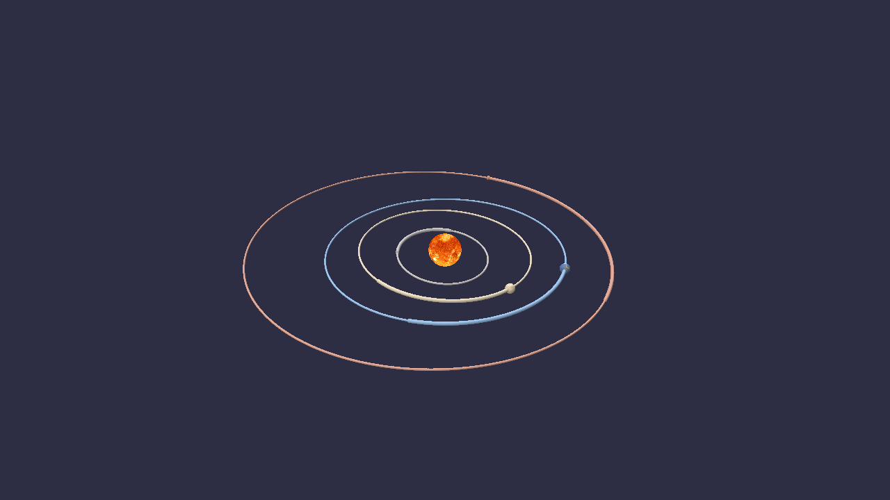

# orrery

[](https://github.com/art3mes/Orrery/actions/workflows/tests.yml)
[](pyproject.toml)
[](LICENSE)

Where the planets actually were, on any date from 1850 to 2050 — checked
against NASA rather than asserted.

An orrery is a mechanical model of the solar system. This is the software kind,
built the same way round: get the positions right first, and only then draw
them.

## The idea

Six numbers describe an ellipse in space and where a planet sits on it. Six more
describe how those numbers drift, per century. JPL publishes both, for every
planet, in a table small enough to paste into a source file — 108 floats for
the whole solar system.

Turning them into a position needs one awkward step. A planet moves fast near
the Sun and slow far away, so *how much of the orbital period has elapsed* is
not *how far round the ellipse the planet has gone*. Converting between them is
Kepler's equation:

```
M = E - e sin(E)
```

`M` follows from elapsed time. `E` fixes the position. No rearrangement gives
`E` in closed form, so it is solved by Newton's method — about ten lines, four
iterations, machine precision. Everything after that is rotating a 2-D ellipse
into 3-D by three angles.

That is the whole model. The interesting question is not whether it produces
ellipses; it is *how wrong* the ellipses are, which is what M0 answers.

## Status: complete, M0 to M6

| | | Gate | |
|---|---|---|---|
| **M0** | Elements → position. No graphics. | Measured against JPL DE440 over 1850–2050 | **passing** |
| **M1** | 3-D scene: spheres, orbit rings, trails, time scrubber | Rings carry their planets; conjunction, transits and oppositions against DE440 | **passing, 4/4** |
| **M2** | Real gravity: mutual attraction, symplectic integration | Conservation over 1000 yr; 50-yr drift vs DE440; Mercury's perihelion | **passing, 3/3** |
| **M3** | The view from Earth: light-time, aberration, parallax | Apparent places against Skyfield; transits timed from real sites | **passing, 4/4** |
| **M4** | The Moon, and eclipses | Cone geometry; two solar eclipses and one lunar against *observed* circumstances; the saros | **passing, 4/4** |
| **M5** | Textures, axial tilt, rotation, rings | Periods and obliquities against published; the analemma; the map's orientation; ring radii | **passing, 5/5** |
| **M6** | The Moon, computed here | Meeus's worked example; DE440 over a century; what it costs an eclipse; the Moon's periods | **passing, 4/4** |

```bash
pip install -e ".[truth,viz,dev]"
python -m pytest                    # 333 tests, no network, ~31 s
python scripts/validate_m0.py       # positions
python scripts/validate_m1.py       # the scene, checked with no window
python scripts/validate_m2.py       # gravity  (~2.5 min; --quick halves it)
python scripts/validate_m3.py       # apparent places
python scripts/validate_m4.py       # eclipses
python scripts/validate_m5.py       # orientation and rotation
python scripts/validate_m6.py       # the Moon
python scripts/demo_m0.py
python scripts/demo_m1.py           # the viewer
python scripts/demo_m2.py           # energy, and the missing 43 arcseconds
python scripts/demo_m3.py           # light-time, and Mars going backwards
python scripts/demo_m4.py           # an eclipse track on the ground
python scripts/demo_m5.py --body earth --from-sun    # one planet, close up
```



Distances are exactly right and the spheres are a thousand times too big. That
number is on screen next to the slider that sets it.

## What M0 measures

41 dates was not enough — the error oscillates rather than growing, so a coarse
grid samples the envelope by luck. This is 2001 dates, every ~36 days from 1850
to 2050, against JPL DE440:

| body | max position error | rms | max sky error from Earth |
|---|---|---|---|
| Mercury | 6 800 km | 2 100 km | 35″ |
| Venus | 14 800 km | 6 500 km | 74″ |
| Earth–Moon barycentre | 16 700 km | 7 000 km | — |
| Mars | 100 700 km | 35 600 km | 211″ |
| Jupiter | 1 863 000 km | 832 000 km | 631″ |
| Saturn | 4 977 000 km | 2 691 000 km | 829″ |
| Uranus | 1 681 000 km | 971 000 km | 127″ |
| Neptune | 1 606 000 km | 904 000 km | 61″ |
| Pluto | 1 570 000 km | 895 000 km | 60″ |

Read the two columns as different questions. **Position error** is dominated by
along-track displacement — the planet is on very nearly the right orbit, at
slightly the wrong point along it — which is why the kilometre figures look
alarming while the angles stay small. **Sky error** is what an observer would
notice, and it folds in Earth's own error too, since you have to stand
somewhere.

Jupiter and Saturn are the worst by an order of magnitude, and that is not a
transcription error: they sit near a 5:2 resonance, and their mutual pull
produces a periodic term in longitude with a period of centuries. A model whose
elements drift *linearly* cannot represent a term that oscillates, so it eats
the amplitude as error.

## Why gate before drawing anything

A wrong orbit still looks like an ellipse. Planets still circle, still speed up
near perihelion, still make a perfectly convincing picture. There is no visual
symptom for a bad angle conversion, a rate applied per year instead of per
century, or a mistyped digit — so the only honest check is an independent
implementation, and DE440 is not an approximation of this model but a numerical
integration fitted to radar ranging and spacecraft tracking.

Two checks in `tests/` exist for failures that leave no other trace:

- **The element table is diffed against JPL's live page**, digit for digit. One
  wrong digit would move a planet while every conserved quantity still checked
  out, every orbit still closed, and the result was still an ellipse. All 96
  published numbers match. (JPL's current table 1 covers the eight planets;
  Pluto's row is from an earlier revision and rests on the gate alone.)
- **Rates are asserted to be per century, not per year.** Earth's mean longitude
  advances ~36000°/century. Reading that as degrees per year builds a solar
  system that runs a hundred times too slow and looks entirely normal.

## What the gate caught

**The error had to be shown to oscillate.** The first run gave numbers a few
times larger than JPL's published accuracy figures, which is exactly the size a
subtle frame or units bug would produce. Plotting error against time settled it:
every body passes through near-zero at some epoch — Venus 0.3″ in 2024, Mars
1.0″ in 2000, Neptune 0.6″ in 1850. A constant offset cannot do that, so the
frame rotation and unit conversions are clean and the residual is model error.
Reporting a number without this check would have been reporting a number without
knowing what it meant.

**Refining a minimum made it worse.** The event finder fits a parabola through
the three samples around an extremum, which normally beats taking the smallest
sample. At a conjunction it did the opposite: on a 0.02-day grid it placed the
2020 closest approach 24 minutes *further* from DE440 than its own raw argmin.
A near-flat minimum makes the fitted curvature badly conditioned, and the vertex
flies outside the bracket. The fix is a theorem, not a fudge — for a smooth
function on a uniform grid the extremum is always within half a step of the
argmin — so clamping there costs nothing when the fit is good and saves it when
it is not. Caught only because two scripts computing the same DE440 quantity
disagreed by 28 minutes.

**Conserving energy is not the same as getting the orbit right.** The symplectic
integrator holds energy in a band of 5.7 × 10⁻⁷ for a thousand years, which
looks like a licence to trust it. Run the Sun and Mercury alone — a two-body
orbit, which does not precess at all — and it turns the apse line at 67″ per
century out of nothing, from a fixed step and finite-difference truncation
alone. That is an eighth of the Newtonian signal M2 sets out to measure. The
control run is therefore not a nicety: without it, "532″ per century" would have
been reported as 596. It converges as the fourth power of the step (2636″ at
dt = 0.5 d, 67.6″ at 0.2, 4.2″ at 0.1) and it cancels almost exactly between two
runs that differ only in whether the GR term is switched on, which is why the
43″ result is far sturdier than the 529″ one.

**The plane you measure the perihelion against changes the answer.** The trap
flagged before building M2 was equinox precession — 5028″/century of pure
coordinate motion. The one actually hit was quieter: longitude of perihelion is
Ω + ω, both referred to a reference plane, and reading the same state vectors
against the equator instead of the ecliptic moves Mercury's rate by 11″/century.
That is a quarter of the entire GR signal, and both numbers look perfectly
reasonable. Every rate M2 quotes names its plane.

**A tolerance finer than the numbers could represent.** The light-time solver
iterated until two successive emission times agreed to 1e-12 days. A Julian date
is about 2.46 × 10⁶, where a float64 steps by 4.7 × 10⁻¹⁰ — so that threshold
could only ever be met by two iterates landing on the *same bit pattern*.
Distant planets do reach such a fixed point and it worked for three milestones.
The Moon, seen from a point on a spinning Earth, flips between two neighbouring
representable values forever, and M4 was the first thing to ask. Now 1e-9 days:
86 microseconds, in which the Moon moves 9 cm.

**A triangle subtracted twice.** The area where two discs overlap is two
circular segments minus the kite between the intersection points; the kite came
off twice. Two equal discs a radius apart read 0.115 instead of 0.391. It could
only ever show on *partial* eclipses — total and annular ones take the
one-disc-inside-the-other branch — so every headline number was right and
Rome's 2027 obscuration was reported as 58.6% when it is 74.6%.

**A correction I talked myself into.** Retarding the Sun by the light-time to
the Moon looked like it should shift the shadow 40 km, and the comment said so.
It moves it **7 km**: what travels in those 8.3 minutes is the Sun's
*barycentric* motion, 12 m/s, not the Earth's 30 km/s. Retarding the observer is
the big correction; retarding the source is not. The code kept the term because
it is correct, and the comment was rewritten because it was not.

**The flat minimum came back.** Greatest eclipse is when the shadow axis passes
closest to the Earth's centre — and for 2024 that miss distance changes by under
3 km across three minutes. The time is badly conditioned even though the
geometry is not, exactly as a 2.5′ position error moved M1's great conjunction
by ten hours. So M4 claims the landing point to 17 km and the duration to 2 s,
and the instant only to three minutes.

**"North" means two different things.** The IAU fixes a planet's north pole as
the one on the north side of the invariable plane, whatever way the body turns,
and puts the sense of rotation in the sign of the W rate. So Venus's tabulated
pole sits 2.6 degrees from its orbit normal — which would make it the most
upright planet in the solar system, and it is a perfectly plausible number. Its
obliquity is 177.4: it turns backwards, and its angular momentum points the
other way. Uranus reads 82.2 instead of 97.8 the same way. Dwarf planets use the
right-hand rule instead, so Pluto needs no flip and Pluto alone. Caught by
checking obliquities against published values rather than eyeballing a globe.

**The map starts at the antimeridian.** An equirectangular planet map puts the
prime meridian down the *middle* of the image, so longitude 0 is u = 0.5. The
sphere was built starting at longitude 0, which rotated every planet by half a
turn. On Jupiter that is invisible. On the Earth it put the Sun over the Pacific
at noon UT, which is how it was found — and the fix is checked by sampling ten
known coastlines rather than by looking.

**A test that agreed for the wrong reason.** M3's deflection test placed a
target a thousand au behind the Sun, offset sideways by one solar radius *in au*
— which sounds like grazing the limb and is not. The impact parameter of that
ray is a thousand times smaller, so it passes straight through the Sun, where
the guard clause correctly suppresses the whole correction. The test measured
zero and reported the answer to be 1.75 arcsec off. The geometry, not the code,
was wrong: an observer 1 au out has to aim at the Sun's *angular* radius.

**A "final" state that was nothing of the kind.** `integrate()` recorded samples
every *n* steps and stopped there, so when the span was not a whole number of
sampling intervals the last recorded state was from partway through the run. The
time-reversibility test surfaced it, and only because the numbers were absurd
rather than merely bad. Its earlier version had been passing vacuously: with the
sampling interval larger than the whole run, it compared the initial state
against itself and got exactly zero.

**The great conjunction is a trap.** `demo_m0.py` finds Jupiter and Saturn 6.000
arcmin apart in December 2020 against DE440's 6.104 — apparently arcminute
accuracy from a model with arcminute errors. It is not. On that date the model
puts Jupiter 0.4′ and Saturn 2.5′ from their true positions; both displacements
point much the same way, and most of the error cancels in the difference. The
*date* is the weaker number: the separation curve is nearly flat at closest
approach, so Saturn's 2.5′ moves the minimum by ten hours. M1 gates conjunctions
to about a day and does not claim arcminute separations.

## What M1 checks

A rendering layer can be wrong in ways the positions cannot: an orbit ring drawn
from the wrong epoch, a trail that silently extrapolates past the table, a
planet drawn somewhere its own orbit does not go. None of those look wrong on
screen. So `scene.py` holds all the geometry and `view.py` holds nothing but
wiring, and the gate runs with no window at all.

| gate | result |
|---|---|
| Rings carry their planets | worst gap = 1.000 × the polyline's own sagitta |
| Trails end at the planet | 3 × 10⁻¹² au, and never sampled outside 1800–2050 |
| Jupiter–Saturn, Dec 2020 | +10.3 h vs DE440 |
| Venus transits 2004, 2012 | on the disc both times; contacts within 0.1 h |
| Mars oppositions, 1990–2050 | 28 found, 28 matched, rms 0.4 h, worst 1.1 h |

Every event is computed from DE440 by the *same* finder, never against dates
copied from an almanac. An almanac disagreement cannot tell you whether the
model or the definition is at fault — published opposition dates use apparent
geocentric right ascension, this uses maximum elongation, and those two differ
by hours on their own.

The conjunction's 10.3 hours is not a surprise, it is M0's prediction coming
true. On that date Saturn sits 2.5′ from where it should, the separation curve
at closest approach is nearly flat, and a flat minimum converts a small position
error into a large time error. Oppositions have no such problem — the elongation
curve there has real curvature — which is why the same model is 25 times more
accurate about them.

## What M2 measures

The fixed ellipses are gone. Every body pulls on every other, the Sun included,
and the whole thing is integrated in the barycentric frame with a fourth-order
symplectic method.

**Conservation, 1000 years, 2-day step.** Energy swings by 5.7 × 10⁻⁷ of itself
and stays in that band; its linear trend over the whole span is 0.3% of the
swing. Runge-Kutta at the same step drifts 150,000 times faster. Angular
momentum holds to 6 × 10⁻¹⁵, linear momentum to 10⁻²².

**Fifty years against DE440**, started from DE440's own state vector, GR on,
0.1-day step. The error is split along the direction of travel and across it,
because the two mean different things:

| body | across track | along track |
|---|---|---|
| Mercury | 375 km | 112,000 km |
| Venus | 16 km | 6,100 km |
| Earth–Moon barycentre | 4 km | 6,800 km |
| Mars | 3 km | 213 km |
| Jupiter | 3 km | 90 km |
| Saturn | 0 km | 9 km |
| Uranus | 35 km | 146 km |
| Neptune | 150 km | 201 km |
| Pluto | 195 km | 101 km |

*Across* is whether the orbit is the right shape, in the right plane, at the
right orientation — that is the force model, and 375 km over fifty years says
the masses and the interactions are right. *Along* is only whether the planet is
at the right point on that orbit, and a fixed-step integrator gets it slightly
wrong forever: its shadow Hamiltonian implies a mean motion a hair off the true
one, and the phase error accumulates. Mercury shows it first because it laps
everything else.

**Mercury's perihelion.** The headline, and the reason M2 exists.

```
integrator artifact     67.57"/cy   (two-body control; the true answer is 0)
Newtonian gravity      528.74"/cy
with the GR term       571.70"/cy
DE440                  571.76"/cy

Newton falls short by   43.03"/cy
the GR term supplies    42.97"/cy   (theory says 6πGM/c²a(1-e²) = 42.98)
leaving                 -0.06"/cy against DE440
```


Eight planets pulling on each other get Mercury's perihelion to within 43
arcseconds per century of where it really goes, and no arrangement of Newtonian
masses closes that gap. One term — `GM/(c²r³)[(4GM/r − v·v)r + 4(r·v)v]` — closes
it to six hundredths of an arcsecond.

## What M3 measures

Everything up to here computed geometry, and nobody has ever observed geometry.
Light takes minutes to arrive, bends past the Sun, and lands tilted by the
observer's own motion; the frame it is quoted in drifts; and the observer is not
at the centre of the Earth. For Mars today those come to:

| correction | size |
|---|---|
| light-time (15.3 minutes) | 12.98″ |
| aberration | 11.17″ |
| gravitational bending | 0.004″ |
| precession + nutation to date | 1350.55″ |

Aberration alone is larger than Mercury's entire M0 sky error. A model right to
an arcsecond and uncorrected is wrong by twenty.

The gates are layered so each measures one thing, and each is fed *exactly* the
same DE440 geometry as Skyfield — so a disagreement is a transformation, never
an orbit.

**The physics chain** — light-time, deflection, aberration — agrees to between
3 × 10⁻⁸ and 7 × 10⁻⁵ arcsec. That is not a tolerance, it is the interpolation
noise floor; the transformations are exact.

**The equinox of date** agrees to 0.02–0.50″, and — the point — *by the same
amount for every body*, to within 0.009″. A frame error looks like that. A
physics error does not. The floor is the four-term nutation series, not anything
fixable without IAU 2000A's 1365 terms.

**Standing somewhere** agrees to 0.012″ against Skyfield's own topocentric
places, while parallax itself moves Venus by up to 28″.

**Retrograde**, the observation that broke the geocentric model, comes out
within 6 minutes of Skyfield: Mars turns on 2024-12-07, backs up for 79 days,
and turns again on 2025-02-24.


### The transits, timed from real places

The 2004 and 2012 Venus transits, in UT, computed for three observatories at
once:

```
Venus transit of 2004
  (geocentric)                  05:14  05:33  11:06  11:26
  Royal Observatory, Greenwich  05:20  05:40  11:04  11:23
  Mauna Kea                     05:09  05:29  11:03  11:23
  Paranal                       05:14  05:34  11:13  11:32
```

First contact differs by **11 minutes** between sites. That difference is
parallax, and measuring it during the transits of 1761 and 1769 is how the
astronomical unit was first pinned down. The geocentric times land within about
a minute of the published values — the first number in this project checked
against an observation rather than against JPL.

## What M4 measures

Everything built so far has to be right at once, and for the first time the
answers are checked against **observations** rather than against JPL. Eclipse
circumstances are published to the second and were watched by millions.


That is the axis of the Moon's shadow — placed by DE440, corrected for
light-time, intersected with a WGS84 ellipsoid turned by the IAU rotation
elements and clocked by measured delta T — crossing the ground on 2 August 2027.

| gate | result |
|---|---|
| The cones | 2024 cone 374 195 km vs a Moon at 359 779 → reaches → **total**; 2023 cone falls **24 415 km short** → **annular** |
| 2017 and 2024 total solar | landing point 19 km and 17 km from published; totality +2 s at both |
| 2025 total lunar | seven contacts, worst 2.8 min |
| Saros | one saros on, the same eclipse, **119°** further west |

The cone gate is the one worth pausing on. Whether an eclipse is total or
annular is not looked up — it falls out of similar triangles. The umbral cone is
374 000 km long and the Moon averages 384 400 km away, so the tip usually
misses, and totality exists only in the few percent by which the Moon's distance
varies.

For 2027, from places along the track:

```
  place                         kind  magnitude  obscured   central
  Luxor, Egypt                 total      1.036    100.0%    6m 22s
  Jeddah, Saudi Arabia         total      1.029    100.0%    6m 00s
  Tangier, Morocco             total      1.034    100.0%    4m 54s
  Cadiz, Spain                 total      1.008    100.0%    2m 56s
  Rome, Italy                partial      0.786     74.6%        --
```

Six minutes twenty-two at Luxor, against a published maximum of 6m 23s. It is
the longest totality anywhere on land until 2114.

## What M5 measures

The planets are spheres carrying real maps, turned to their real orientation for
the date: the IAU pole, the axial tilt, and the prime meridian where it actually
was.


That is the Earth seen from the Sun at 12:00 UT. Africa faces us because the
sub-solar longitude is 0.2 degrees east — and that is the check, not the
picture. If anything in the chain from the rotation elements through the
body-fixed frame to the texture coordinates were wrong, a different ocean would
be lit.

None of M5's gates look at the rendering. Every failure mode still looks like a
planet.

| gate | result |
|---|---|
| Rotation periods, from the tabulated W rates | worst 5 × 10⁻⁶ of the period, across 9 bodies |
| Obliquities, from the poles and M0's orbits | within 0.01° for 8 of 9 |
| The analemma | ±23.44° latitude, 30.6 min of equation of time, all four season dates exact |
| The map's orientation | 10/10 known coastlines land or sea as they should |
| Shape | flattening derived from published radii; ring edges are published radii |

The analemma is the one that matters. The rotation table contains a pole and an
angle that ticks; it knows nothing about seasons. Track the sub-solar point at
noon UT for a year and out falls the Sun's declination reaching exactly the
obliquity, the equation of time spanning 30.6 minutes against a published 30.5,
and the solstices and equinoxes on 21 June, 21 December, 20 March and
23 September 2026 — the right days.

The viewer has a **focus** mode: pick a body and the camera goes to it at true
size, with the time scrubber still running, so you can watch it turn. The
focused body is drawn at the origin rather than at its real position — a planet
is 4 × 10⁻⁵ au across sitting 1 au out, and a camera close enough to read the
map would be resolving one part in 25 000 of the scene, which the depth buffer
will not do.

Planets are flattened by their own spin, from published polar and equatorial
radii: 0.098 for Saturn, 0.065 for Jupiter, 0.0034 for the Earth. The squash is
applied *before* the rotation so it follows the tilt — doing it after leaves
every planet flattened about the ecliptic pole, which looks plausible until
Saturn is squashed the wrong way relative to its own rings.

Three ring systems are drawn, every edge a published radius: Saturn's C, B,
Cassini division and A; Jupiter's halo, main and two gossamer rings; and all ten
of Uranus's, by name, from **6** out to **ε**. Geometry is emitted only where a
ring actually is — Uranus's rings cover under 2% of their span, so one disc plus
opacity would be 98% empty and the radial samples would land between the rings
and miss them entirely.

Uranus's rings are drawn at least 250 km wide against a real narrowest of 2 km,
which is a sixtieth of a pixel. That is the same bargain as the planet radii,
and the gate prints both numbers.

Planet maps are from **Solar System Scope**, CC BY 4.0.

## What M6 measures

Through M5 the Moon came from DE440, which made M4's eclipses a test of shadow
geometry sitting on somebody else's orbit — the last place in this project
where ground truth was an *input* rather than the thing being measured.

`lunar.py` closes that: the abridged ELP-2000/82, five fundamental angles, sixty
periodic terms for longitude and distance and sixty more for latitude.

| gate | result |
|---|---|
| Meeus's worked example | longitude, latitude and distance to **six decimal places** |
| Against DE440, 1950–2050 | **3.12″ rms**, 15.5″ max; distance 3.0 km rms |
| What it costs the 2024 eclipse | **3 km** of track, **0 s** of totality |
| The Moon's periods | all four months, plus 18.61 and 8.85 years |

The third one is the answer to the question the first two only gesture at.
Three arcseconds is abstract; running M4's eclipse machinery on this Moon
instead of DE440's moves the 2024 track by three kilometres and changes totality
at Nazas by under a second. The abridged theory is good enough for the job it
was built for.

The fourth is the one worth looking at:

```
month                 ours   published   days
tropical         27.321582   27.321582
synodic          29.530589   29.530589
anomalistic      27.554550   27.554550
draconic         27.212221   27.212221
sidereal         27.321662   27.321662

nodes regress once in 18.61 years   (published 18.6)
apsides turn once in   8.85 years   (published 8.85)
```

None of that is in the table. Every one is a difference between the rates of
four angles. The tropical and sidereal months differ by 6.9 seconds, and that
6.9 seconds is the equinox moving under the Moon at 50.3 arcsec a year and
nothing else. The 18.61 years is why eclipse seasons drift, and why a saros is
eighteen years and eleven days rather than a round number.

Why the Moon needs sixty terms where a planet needs six: its largest periodic
term is **6.29 degrees**. The Sun's is 1.9. Nothing else in the solar system is
pulled about like this.

## What M0 already answers

No graphics required:

```
Earth-Moon barycentre, 2026
  perihelion  2026-01-03 18:14   0.983304 au
  aphelion    2026-07-05 09:22   1.016704 au

Mars at opposition
  2020-10-14   0.419 au      2027-02-19   0.678 au
  2022-12-08   0.550 au      2029-03-25   0.649 au
  2025-01-16   0.644 au      2031-05-04   0.559 au
```

Every opposition date but the first matches the published one exactly; 2020 is
a day out. Nothing in the code knows when Mars is at opposition — it falls out
of Earth and Mars both being in the right place.

The oppositions are not exactly 180° of elongation because Mars's orbit is
inclined to Earth's, so the two rarely line up perfectly in latitude. That is
real, not slop.

## Layout

```
src/orrery/          the model. numpy only; nothing here imports Skyfield
  times.py           calendar <-> Julian date; J2000 and the century
  elements.py        the JPL element table, verbatim, plus drift to any epoch
  kepler.py          Kepler's equation; elements <-> position, velocity, orbit ring
  frames.py          ecliptic <-> equatorial, angular separation, RA/Dec
  events.py          extrema and crossings: conjunctions, oppositions, transits
  nbody.py           mutual gravity, the 1PN term, symplectic integrators
  apparent.py        light-time, gravitational bending, aberration
  precession.py      equinox of date, nutation, sidereal time
  observer.py        WGS84, delta T, a place on the Earth and how fast it moves
  eclipse.py         shadow cones, where they land, and what they cover
  rotation.py        IAU pole and prime meridian, obliquity, sub-solar point
  scene.py           orbit rings, trails, display sizes, view framings
  globe.py           UV spheres, texture maps, coordinate -> pixel
  view.py            polyscope wiring, and nothing else
  truth.py           DE440 and Skyfield, cached to fixtures. The only outside world

scripts/
  validate_m0.py     positions against DE440
  validate_m1.py     the scene, and events against DE440. No window needed
  validate_m2.py     conservation, drift, and Mercury's perihelion
  validate_m3.py     apparent places against Skyfield, and the Venus transits
  validate_m4.py     eclipse cones, two solar and one lunar, the saros
  validate_m5.py     periods, obliquities, the analemma, the map's orientation
  demo_m0.py         positions, perihelion, oppositions, the conjunction
  demo_m1.py         the viewer
  demo_m2.py         symplectic versus Runge-Kutta, and the missing 43 arcsec
  demo_m3.py         how old the view is, and Mars going backwards
  demo_m4.py         an eclipse track drawn on the ground
  demo_m5.py         one body, close up, oriented for a date

tests/               333 tests, offline, plus one network diff against JPL
data/                fixtures, delta T, textures. See data/README.md
docs/images/         the figures in this file, all reproducible by the demos
```

The dependency arrow runs one way. `src/orrery` is numpy and nothing else,
except `truth.py`, whose entire job is to be the outside world: it is the only
module that knows Skyfield exists, and no other module imports it. That is what
makes the gates mean something — the thing being measured cannot reach the
ruler.

`events.py` works on arrays of positions and never on body names, for the same
reason. It lets a gate ask the same question of this package and of DE440
through identical code: if the two used different finders, a disagreement could
not say which half was wrong.

## Choices worth knowing about

**Everything is TDB.** No leap seconds, no UTC conversion anywhere. UTC differs
from TDB by ~69 s today and the Earth covers 2000 km in 69 s — a tenth of the
error budget, thrown away for nothing. Both sides of the gate are built in TDB,
so the question never arises.

**"Earth" is the Earth–Moon barycentre.** That is what the table's third row
is. The Earth itself orbits it by up to ~4700 km. `canonical("earth")` returns
`embary` and the name is used everywhere the distinction could matter.

**Ground truth is geometric, not apparent.** `truth.py` uses Skyfield's `.at()`,
not `.observe()`, so there is no light-time correction and no aberration on
either side. Those are real effects belonging to an observer, and folding them
into one side only would be comparing two different questions. Light-time
arrives in M3.

**Scene units are au, exactly.** Positions are never rescaled, compressed or
log-mapped — the usual trick for fitting Pluto and Mercury in one picture, and
the reason most pretty solar systems are useless for measuring anything. The
only lie is sphere size, it is linear so size *ratios* survive, and the factor
is displayed. The Sun gets its own much smaller factor; at the planets' setting
its sphere would reach past Mercury's perihelion, and the viewer says so when it
does.

**Orbit rings are geometry, not trajectory.** A ring is the osculating ellipse:
elements evaluated once, then the eccentric anomaly swept right round. Sampling
Neptune's actual path over a period would run 165 years past the date asked for,
out of the table and into extrapolation. Sweeping E stays at one instant, so the
ring is exactly as valid as the position is.

**The scrubber counts days, not Julian dates.** ImGui sliders are single
precision, and float32 steps by 0.25 days at 2.45 × 10⁶ — a slider bound to the
Julian date snaps in six-hour jumps. Days since 1850 reach 73048, where the step
is 11 minutes. Fractional years, the obvious alternative, are worse at 64.

**M2 integrates in the barycentric frame, with the Sun as a body.** Keeping the
Sun at the origin is the obvious thing and it is wrong: Jupiter pulls the Sun
about, so that frame accelerates, and a symplectic integrator in an accelerating
frame is not symplectic. The energy behaviour that was the entire reason for
choosing one quietly goes away.

**Masses are carried as GM, not as kilograms.** GM of the Sun is known to ten
significant figures; the mass of the Sun in kilograms is known to five, because
*G* is. Dividing by G to get a mass and multiplying by it again to get a force
throws away five digits for nothing.

**The mass ratios are the one unchecked input.** Every other number in the
package is derived from something else here or diffed against its source. The
Sun-to-planet mass ratios are not: they are typed in from the DE440 header. What
stands behind them is the 50-year drift gate, where a mass wrong by a part in a
thousand would show up immediately in the across-track column.

**The velocity is the two-body one.** `state()` computes speed from the
semi-major axis using GM of the Sun alone, ignoring the century drift of the
elements. It is the right thing for seeding an N-body run and agrees with a
numerical derivative of the position to a part in 1e4 or better. For Pluto the
gap reaches 0.07%, because the table's semi-major axis and its mean-longitude
rate were fitted independently and imply periods differing by that much.

## Caveats

- **1850–2050, and no further.** The element table is specified for 1800–2050,
  and DE440s starts in December 1849, so 1850 is where the two overlap. Dates
  outside the table's range raise a `RuntimeWarning`; the rates are linear
  extrapolations and degrade fast. JPL publishes a second table for
  3000 BC – 3000 AD with extra periodic terms for Jupiter outward; it is not
  implemented here.
- **Nothing is validated against an observation.** DE440 is the reference, and
  DE440 is itself a fit. That is the right reference for this milestone, but it
  means the gate measures agreement with JPL, not truth.
- **The integrator is not a Wisdom-Holman map.** It splits kinetic from
  potential energy, not Kepler motion from perturbation, so it manufactures its
  own apsidal precession (67″/century at a 0.2-day step) and its own mean-motion
  offset (Mercury's 112,000 km of along-track drift over fifty years). Both are
  measured rather than assumed — the two-body control run, and the across/along
  split — and both would largely disappear under a mixed-variable symplectic
  map. That is the obvious next thing to build and it is not built.
- **Gravity is Newtonian plus one term.** The relativistic correction is the
  1PN Schwarzschild term in the Sun's field only: no planet-planet relativistic
  terms, no solar oblateness, no asteroids, no lunar dynamics beyond treating
  the Earth-Moon barycentre as a point. For Mercury's perihelion those are all
  far below the 43″ signal. For Mars over centuries, the asteroids would not be.
- **M1's transit contact times are geometric.** M3's are not: they carry
  light-time and a real observer. The two differ by minutes, which is the point.
- **The nutation series is four terms.** That puts a floor of about half an
  arcsec under anything quoted in coordinates of date, while the underlying
  apparent place is good to microarcseconds. IAU 2000A would remove it. The
  ICRF-to-J2000 frame bias, 23 mas, is also not applied.
- **Delta T now comes from measured values**, cached to `data/delta_t.npz`, and
  falls back to Espenak & Meeus's polynomials if that file is absent. The
  polynomial was 6.2 s out by 2026 and 18.6 s by 2045; eclipse timing needed
  the real thing, which is why M4 depended on it.
- **The lunar theory is abridged.** 120 terms against the full ELP-2000/82's
  twenty thousand, which is 3″ rms and 15″ at worst. M4's eclipse gates still
  run on DE440's Moon; M6 measures the difference rather than swapping it in,
  so the eclipse numbers stay pinned to the best available orbit.
- **Only the centre line, not the path limits.** The track drawn is where the
  shadow *axis* lands. The northern and southern limits of totality, and the
  width of the band, are not computed.
- **The Earth's shadow is enlarged by Danjon's 2%** for the atmosphere. Sources
  differ over the rule, which is most of the 2-3 minute spread on the late lunar
  contacts.
- **No refraction, no rise and set times, no planetary magnitudes.** Refraction
  only matters near the horizon, and it depends on the weather.
- **The globes are spheres, and lit from everywhere.** No oblateness (Saturn is
  visibly flattened in reality, by 10%), no rings, no night side, no clouds
  moving. Pluto has no map at the source used and falls back to flat colour.
- **The rotation table omits its periodic terms.** Mercury, Mars, Neptune and
  the Moon have libration terms of up to 0.7 degrees that are not implemented;
  Neptune's obliquity is 0.47 degrees off because of it. The maps are 2048
  pixels wide, which is 10 arcminutes a pixel, so it does not show.
- **The first gate run needs the network** — 32 MB of DE440s, and Skyfield
  caches it under `data/`. After that the fixture in `data/fixtures/` is enough,
  and `--offline` enforces it. On a machine behind a TLS-inspecting proxy or
  antivirus the download fails certificate verification; installing
  `truststore` (included in the `truth` extra) defers to the OS certificate
  store and fixes it without weakening verification.
- **The regression check is a ratchet, not a specification.** `data/baseline_m0.json`
  records what the model measured, and the gate fails if a change makes it 25%
  worse. It does not know what the numbers *should* be; only the blunder
  ceiling — half a degree of sky error, the apparent width of the Moon — is an
  absolute claim.

## Licence

MIT, see `LICENSE`.

Planet maps are from Solar System Scope under CC BY 4.0, which makes attribution
a condition rather than a courtesy; `NOTICE.md` carries that and the rest of the
provenance. The ephemerides are US government works.
