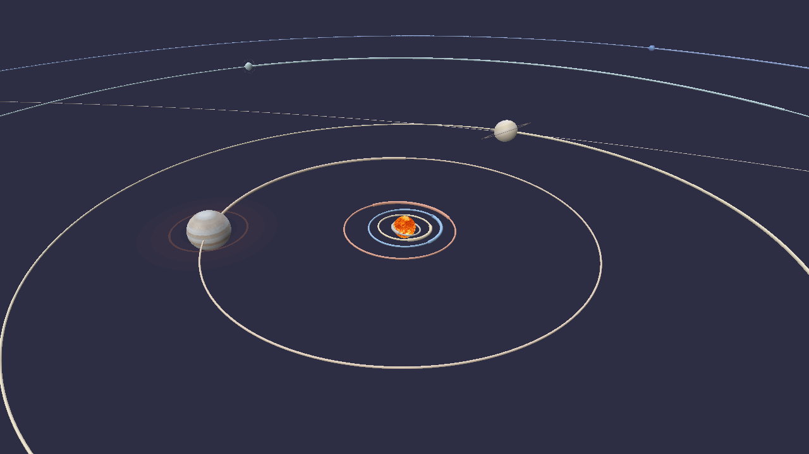
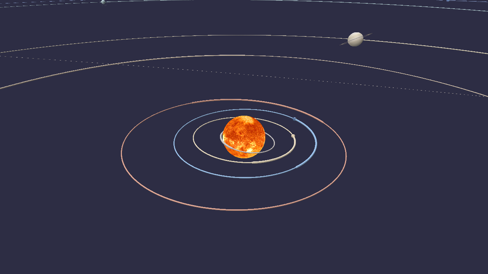
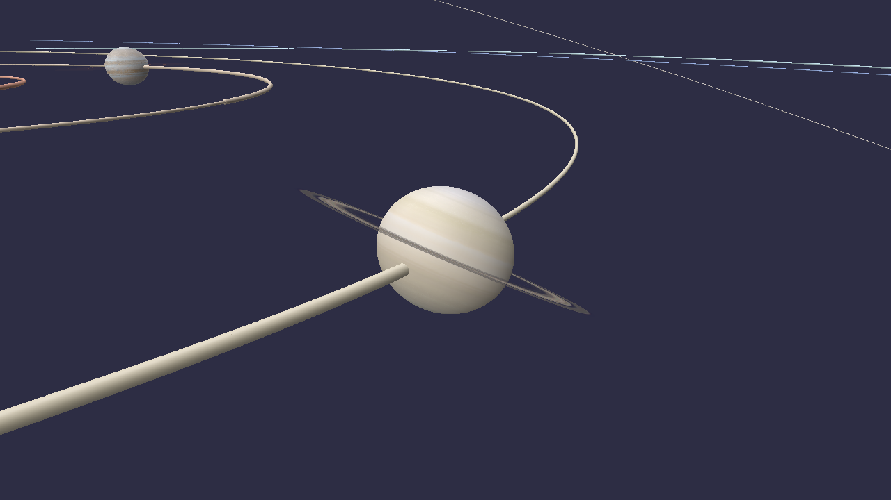
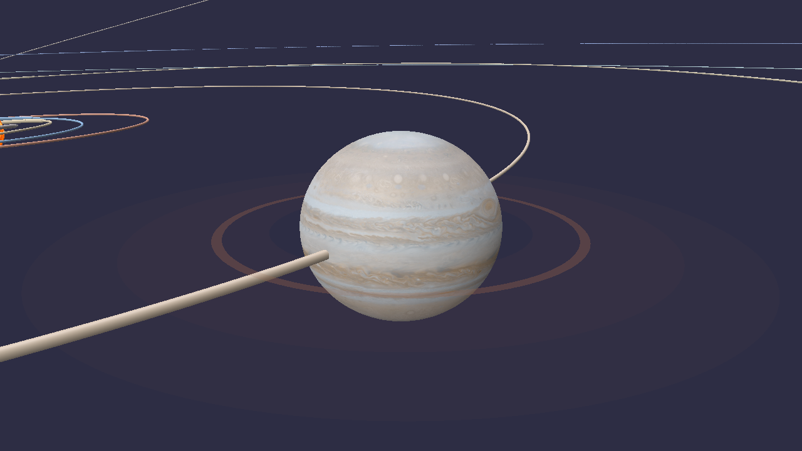
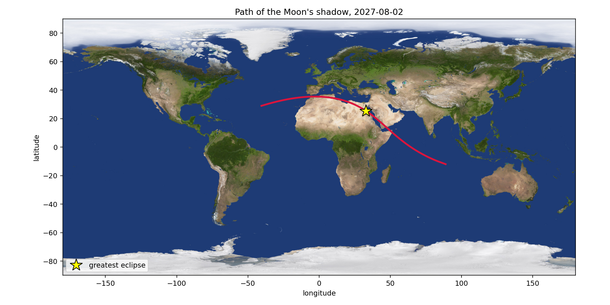

# orrery

[](https://github.com/art3mes/Orrery/actions/workflows/tests.yml)
[](pyproject.toml)
[](LICENSE)
[](https://github.com/art3mes/Orrery/releases)

**Where the planets actually were, on any date from 1850 to 2050 — checked
against NASA rather than asserted.**



*Real positions for 6 September 2026. Jupiter and Saturn carry their rings;
the inner four are nested inside Jupiter's orbit at the middle. Distances
are exact, the spheres are not, and the viewer says by how much.*

## What this is

An orrery is a mechanical model of the solar system. This is the software kind,
in Python: it computes where the planets, the Sun and the Moon really were on a
given date, works out what you would have seen from a particular place on Earth,
and draws the whole thing in 3-D.

The computing half is the point. Anything can draw ellipses, and a wrong orbit
still looks like an ellipse — planets still circle, still speed up near
perihelion, still make a convincing picture. There is no visual symptom for a
rate applied per year instead of per century. So nothing here is drawn until it
has been *measured* against an independent source: JPL's DE440 ephemeris, or
published eclipse circumstances that millions of people stood outside and
watched.

That measurement is not a footnote, it is the deliverable. Every claim in this
README is printed by a script in `scripts/` that you can run yourself, offline,
from data committed to this repository.

## What it can tell you

- **Where a planet is** on any date from 1850 to 2050, in au or as RA and Dec
- **What you would see from a specific place** — light-time, gravitational
  bending, aberration, and the parallax of standing on a turning ellipsoid
- **When the next eclipse is where you live**, how much of the Sun goes, and
  where on the ground the shadow lands
- **When events happen** — full moons, oppositions, conjunctions, transits,
  greatest elongations — found by searching the geometry, never looked up
- **How gravity actually behaves** — all nine bodies pulling on each other, and
  Mercury's 43 arcseconds per century that Newton cannot explain
- **What it looks like** — real surface maps, real axial tilts, real rotation,
  the ring systems of Jupiter, Saturn and Uranus, and polar flattening

| | | |
|:-:|:-:|:-:|
|  |  |  |
| the inner four, nested inside Saturn's orbit | Saturn, its rings, and the orbit running through it | Jupiter and its four faint rings |

All three are the same scene at different camera distances — nothing is a
separate render or a special mode. Fly in and the orbit lines thin out to stay
markings rather than becoming tubes.

## Setup

**Requirements.** Python 3.10, 3.11 or 3.12. `numpy` is the only hard
dependency. About 15 MB to clone. The 3-D viewer needs a GPU; everything else
runs headless.

```bash
git clone https://github.com/art3mes/Orrery.git
cd Orrery

python -m venv .venv
source .venv/bin/activate          # Windows: .venv\Scripts\activate

pip install -e ".[truth,viz,dev]"
```

The extras are separable, and which you need depends on what you want to do:

| extra | pulls in | needed for |
|---|---|---|
| *(none)* | numpy | computing positions, apparent places, eclipses, events |
| `viz` | polyscope, pillow, matplotlib | the 3-D viewer and the plots |
| `truth` | skyfield, truststore | the gates, which check answers against DE440 |
| `dev` | pytest | the test suite |

**Check it works.** No network, no downloads:

```bash
python -m pytest -m "not network"
```

378 tests, about 45 seconds. One further test diffs the element table against
JPL's live web page and is excluded by that marker.

### Where the textures are

In the repository. `data/textures/` holds eleven 2048×1024 surface maps —
Mercury through Neptune, the Moon, the Sun, and Saturn's rings — about 5 MB,
committed, so a fresh clone renders textured planets with nothing to download.

They are from [Solar System Scope](https://www.solarsystemscope.com/textures/)
under CC BY 4.0, which makes attribution a licence **condition** rather than a
courtesy; `NOTICE.md` carries it. Pluto has no map at that source and falls back
to flat colour.

If you delete them, or want a different set:

```bash
python -c "from orrery import globe; [globe.fetch_texture(b) for b in globe.TEXTURE_FILES]"
```

Everything still runs without them — the globes just come out plain.

## Run it

One command. A date in, everything about that date out, then the 3-D view on
the same date.

```bash
orrery 2027-08-02 --at delhi
```

```
2027-08-02 00:00 TDB   --   as seen from New Delhi

  body        RA            Dec         from Earth   from Sun   elongation
  --------------------------------------------------------------------------
  Sun         08h 46.2m   +17d 58.2m      1.0150          --           --
  Mercury     08h 04.1m   +21d 21.6m      1.2443       0.308        10.5d
  Venus       08h 36.0m   +19d 39.6m      1.7302       0.719         2.9d
  Mars        12h 37.2m   -03d 51.5m      1.7815       1.564        60.9d
  Jupiter     10h 13.7m   +11d 56.9m      6.3194       5.391        21.9d
  Saturn      01h 45.9m   +08d 12.1m      9.0887       9.346       101.6d
  Uranus      04h 28.2m   +21d 39.5m     19.8631      19.382        60.4d
  Neptune     00h 24.8m   +01d 06.8m     29.3070      29.872       123.0d
  Pluto       20h 36.5m   -23d 31.9m     34.8169      35.827       174.0d
  Moon        08h 26.2m   +19d 40.0m      0.0024       1.013         5.0d

  The Moon is new, 0% lit, 357,434 km away,
  and 5.0 degrees from the Sun in the sky.

  Solar eclipse from New Delhi: 8.2% of the Sun covered at 2027-08-02 11:00.
  The centre of the shadow lands at +25.0, +33.6 at 2027-08-02 10:10.
```



That last pair of lines is the shadow track above, computed rather than looked
up. Then the 3-D view opens on that date. Under a second, and nothing is
downloaded — the positions come from this package's own orbits.

```bash
orrery                                  # today
orrery 1969-07-20                       # any date from 1850 to 2050
orrery "2024-04-08 18:17" --at mauna_kea
orrery 2027-08-02 --at 30.04,31.24      # or your own latitude, longitude
orrery 2026-09-06 --no-viewer           # text only, no window
orrery --focus saturn                   # open zoomed in on one body
```

`--at` takes `greenwich`, `mauna_kea`, `paranal`, `svalbard`, `delhi`, or any
`lat,lon` pair. Without it, positions are geocentric — from the centre of the
Earth, which is where almanacs quote them.

In the viewer: drag to orbit, scroll to zoom. The panel has a date slider
across the whole 1850–2050 range, play/pause, a *focus* dropdown that locks the
camera onto one body at its true shape — Saturn and Uranus bring their rings,
and `--focus` opens there directly — and sliders for how much the spheres are exaggerated.
They are exaggerated: at true scale, with Earth's whole orbit in frame, the
Earth is about one pixel across. Positions are never exaggerated, and the
factor is on screen next to the slider that sets it.

## Using it as a library

Five questions, ten lines each. All of them run from a clean checkout with
nothing downloaded: `ephemeris()` packs this package's own orbits into the same
object DE440 comes out of, so `truth` is only ever needed to *check* an answer,
never to get one.

**Where is Mars tonight?**

```python
from orrery import SITES, ephemeris, jd, radec

when = jd(2026, 9, 6, 21, 30)
eph = ephemeris(when, bodies=("sun", "geocentre", "mars"))

mars = eph.look("mars", when, site=SITES["greenwich"])
ra, dec = radec(mars.apparent)
print(f"RA {ra[0]:.4f} h   Dec {dec[0]:+.4f} deg   {mars.distance[0]:.4f} au")
```

```
RA 7.2147 h   Dec +23.0066 deg   1.8170 au
```

That is an *apparent* place: light-time, gravitational bending, aberration, and
an observer standing on a turning ellipsoid rather than at its centre. DE440
puts Mars 16.2 arcsec away from there and 25 000 km further off, which is M0's
Mars error arriving somewhere you can see it.

**When is the next eclipse where I live, and how much of the Sun goes?**

```python
import numpy as np
from orrery import Site, ephemeris, events, isoformat, jd, solar_view

site = Site("Cairo", 30.044, 31.236, 23.0)
scan = jd(2027, 1, 1) + np.arange(0.0, 365.0, 2.0 / 1440.0)   # two minutes, one year
eph = ephemeris(scan, bodies=("sun", "geocentre", "moon"))

view = solar_view(eph, scan, site=site)
for when, covered in events.find_extrema(scan, view.obscuration, kind="max", threshold=0.0):
    print(f"{isoformat(when)}   {covered:.2%} of the Sun covered")
```

```
2027-02-06 17:46   27.80% of the Sun covered
2027-08-02 09:57   94.80% of the Sun covered
```

Six seconds, and nothing was looked up: both eclipses fall out of scanning a
year of shadow geometry for maxima. Cairo misses totality in August 2027 —
`eclipse.shadow_landing` puts the axis 541 km south, over Luxor, and M4 gates
that landing point to 17 km. Replace `ephemeris` with `truth.sampled_ephemeris`
and DE440 answers 27.84% and 94.83% at the same two minutes.

**How far away is Jupiter, and how old is the light?**

```python
from orrery import ephemeris, jd

when = jd(2026, 9, 6, 12)
eph = ephemeris(when, bodies=("sun", "geocentre", "jupiter"))

sight = eph.look("jupiter", when)
print(f"{sight.distance[0]:.4f} au, and the light left it "
      f"{sight.light_time_days[0] * 1440:.1f} minutes ago")
```

```
6.1550 au, and the light left it 51.2 minutes ago
```

That distance is the one the light actually crossed, solved by iteration rather
than by dividing the instantaneous separation by *c*. Jupiter moved while the
light was in transit, and so did the Earth.

**When is the next full moon?**

```python
import numpy as np
from orrery import equatorial_to_ecliptic, events, isoformat, jd, model

when = jd(2026, 9, 6) + np.arange(0.0, 120.0, 0.01)
place, _ = model.states(("geocentre", "moon"), when)

sun = equatorial_to_ecliptic(-place[:, 0])
moon = equatorial_to_ecliptic(place[:, 1] - place[:, 0])
longitude = lambda v: np.arctan2(v[:, 1], v[:, 0])
for t, _ in events.find_extrema(when, np.cos(longitude(moon) - longitude(sun)), kind="min"):
    print(isoformat(t), " full moon")
```

```
2026-09-26 16:50  full moon
2026-10-26 04:13  full moon
2026-11-24 14:55  full moon
2026-12-24 01:30  full moon
```

Full moon is 180 degrees of ecliptic longitude between the Moon and the Sun, so
the thing to search is the *cosine* of that difference rather than the
difference itself. An angle taken modulo 360 degrees jumps once a month, a
sign-change finder cannot tell a jump from a crossing, and the obvious version
of this recipe cheerfully reports the new moons as well.

**When is Venus furthest from the Sun in the sky?**

```python
import numpy as np
from orrery import elongation_deg, events, isoformat, jd, position

when = jd(2026, 1, 1) + np.arange(0.0, 730.0, 0.25)
gap = elongation_deg(position("venus", when), position("embary", when))

for t, angle in events.find_extrema(when, gap, kind="max", threshold=20.0):
    print(f"{isoformat(t)}   {angle:.2f} deg from the Sun")
```

```
2026-08-15 05:38   45.89 deg from the Sun
2027-01-03 18:35   46.95 deg from the Sun
```

Greatest elongation, evening then morning, and the two differ by a degree
because Venus's orbit is an ellipse and it matters where on it Venus happens to
be. No apparent-place machinery here at all: this one is geometry straight off
the element table.

**And every one of them can be run twice.** `ephemeris()` and
`truth.sampled_ephemeris()` hand back the same class and take the same
arguments, so changing one line asks the identical question of JPL's orbits
instead of these. That is not a testing convenience bolted on afterwards. It is
the shape the whole package was built to have.

## How accurate is it

Each row is printed by the gate named in the last column, and each was measured
against something built independently of this code.

| | | measured by |
|---|---|---|
| Planet positions, 1850–2050 | Mercury 35″, Venus 74″, Mars 211″, Saturn 829″ of sky error | M0, vs DE440 |
| The transformations to apparent place | 3 × 10⁻⁸ to 7 × 10⁻⁵ arcsec — the interpolation noise floor | M3, vs Skyfield |
| Standing somewhere on Earth | 0.0004″, against a parallax of up to 28″ | M3, vs Skyfield |
| The Moon | 3.1″ rms, 15.5″ worst, over 1950–2050 | M6, vs DE440 |
| Where an eclipse lands | 17 km and 19 km, for 2024 and 2017 | M4, vs observed |
| How long totality lasts | +2 s at both | M4, vs observed |
| Mercury's perihelion | −0.06″/century, after general relativity supplies 42.97 of the missing 43.03 | M2, vs DE440 |

Two columns of the M0 table read as different questions. Position error is
mostly *along track* — the planet is on very nearly the right orbit, at slightly
the wrong point on it — which is why the kilometre figures look alarming while
the angles stay small. Sky error is what an observer would actually notice, and
it folds in the Earth's own error too, since you have to stand somewhere.

Jupiter and Saturn are an order of magnitude worse than the rest. That is not a
typo in the table: they sit near a 5:2 resonance, and their mutual pull puts a
term in their longitudes that oscillates over centuries. Elements that drift
*linearly* cannot represent that, so the model eats the amplitude as error.

### Running the gates yourself

Every number in the table above is printed by one of these. They are slow on
purpose — M2 integrates the solar system for a thousand years — and they are
the only slow thing here; the app itself answers in under a second.

```bash
python scripts/validate_m0.py     # positions against DE440           ~20 s
python scripts/validate_m1.py     # the scene and its events           ~15 s
python scripts/validate_m2.py     # gravity, 1000 years              ~2.5 min
python scripts/validate_m3.py     # apparent places                    ~30 s
python scripts/validate_m4.py     # eclipses                           ~40 s
python scripts/validate_m5.py     # orientation, rotation, rings       ~10 s
python scripts/validate_m6.py     # the Moon                           ~25 s
```

The **first** run downloads `de440s.bsp`, JPL's planetary ephemeris — 32 MB,
once, into `data/`. After that everything is cached in `data/fixtures/`, which
is committed, and `--offline` refuses to touch the network at all. Behind a
TLS-inspecting proxy the download can fail certificate verification; the
`truth` extra installs `truststore`, which defers to the OS certificate store
and fixes it without weakening anything.

There are demos too, one per milestone, which show the working rather than the
verdict:

```bash
python scripts/demo_m0.py    # positions, perihelion, oppositions, the conjunction
python scripts/demo_m2.py    # symplectic vs Runge-Kutta, and the missing 43 arcsec
python scripts/demo_m3.py    # how old the view is, and Mars going backwards
python scripts/demo_m4.py    # an eclipse track drawn on the ground
python scripts/demo_m5.py --body saturn    # one body, close up, correctly tilted
```

## What M0 to M6 mean

The project was built in seven steps and the scripts are named after them. It is
just a build order, and each step is a capability plus the measurement that had
to pass before it counted as done:

| | adds | gated on | |
|---|---|---|---|
| **M0** | Elements to a position. No graphics at all. | DE440, 2001 dates across two centuries | passing |
| **M1** | The 3-D scene: spheres, orbit rings, trails, a date scrubber | Conjunction, transits, oppositions — with no window open | 4/4 |
| **M2** | Real gravity: every body pulls on every other | Conservation over 1000 yr; 50-yr drift; Mercury's perihelion | 3/3 |
| **M3** | The view from Earth: light-time, aberration, parallax | Apparent places vs Skyfield; transits timed from real observatories | 4/4 |
| **M4** | Eclipses | Two solar and one lunar against *observed* circumstances | 4/4 |
| **M5** | Surface maps, axial tilt, rotation, rings, oblateness | Published obliquities and periods; the analemma; ring radii | 5/5 |
| **M6** | The Moon, computed here rather than borrowed from JPL | Meeus's worked example; DE440 over a century; the cost to an eclipse | 4/4 |

**[docs/milestones.md](docs/milestones.md)** has the full result tables, the
figures, and what each gate was actually asking.

**[docs/notes.md](docs/notes.md)** has how the model works, every bug the gates
caught and why each one was invisible, the design decisions that are not obvious
from the code, and the complete list of things this does not do.

## Caveats

The short version. The full list, with measured costs, is in
[docs/notes.md](docs/notes.md).

- **1850–2050, and no further.** The element table is specified for 1800–2050
  and DE440s starts in December 1849. Outside that range the rates are linear
  extrapolations and degrade fast; the code raises a `RuntimeWarning`.
- **DE440 is the reference, and DE440 is itself a fit.** The gates measure
  agreement with JPL, not with the universe. The eclipse gates are the exception
  — those are checked against what was observed.
- **The integrator is not a Wisdom–Holman map.** It manufactures 67″/century of
  its own apsidal precession, which is measured by a two-body control run whose
  true answer is exactly zero, and 112 000 km of along-track drift on Mercury
  over fifty years. Both would largely disappear under a mixed-variable
  symplectic map. That is the obvious next thing to build and it is not built.
- **The lunar theory is abridged** — 120 terms against ELP-2000/82's twenty
  thousand, so 3″ rms and 15″ at worst.
- **Only the centre line of an eclipse**, not the northern and southern limits
  of totality or the width of the band.
- **No refraction, no rise and set times, no planetary magnitudes**, and no
  night side on the globes.
- **Nutation is four terms**, which puts a floor of about half an arcsecond
  under anything quoted in coordinates of date. IAU 2000A would remove it.

## Layout

```
src/orrery/          the model. numpy only; nothing here imports Skyfield
  __main__.py        the `orrery` command: a date in, a report and a window out
  times.py           calendar <-> Julian date; J2000 and the century
  elements.py        the JPL element table, verbatim, plus drift to any epoch
  kepler.py          Kepler's equation; elements <-> position, velocity, orbit ring
  frames.py          ecliptic <-> equatorial, angular separation, RA/Dec
  events.py          extrema and crossings: conjunctions, oppositions, transits
  nbody.py           mutual gravity, the 1PN term, symplectic integrators
  apparent.py        light-time, gravitational bending, aberration
  precession.py      equinox of date, nutation, sidereal time
  observer.py        WGS84, delta T, a place on the Earth and how fast it moves
  lunar.py           the Moon: an abridged ELP-2000/82, 120 terms
  eclipse.py         shadow cones, where they land, and what they cover
  rotation.py        IAU pole and prime meridian, obliquity, sub-solar point
  model.py           these orbits, packed as an Ephemeris. Needs nothing outside
  scene.py           orbit rings, trails, display sizes, view framings
  globe.py           UV spheres, oblateness, rings, texture maps
  view.py            polyscope wiring, and nothing else
  truth.py           DE440 and Skyfield, cached to fixtures. The only outside world

scripts/
  validate_m0.py     positions against DE440
  validate_m1.py     the scene, and events against DE440. No window needed
  validate_m2.py     conservation, drift, and Mercury's perihelion
  validate_m3.py     apparent places against Skyfield, and the Venus transits
  validate_m4.py     eclipse cones, two solar and one lunar, the saros
  validate_m5.py     periods, obliquities, the analemma, the map's orientation
  validate_m6.py     the Moon: Meeus's example, DE440, and what it costs an eclipse
  demo_m0.py         positions, perihelion, oppositions, the conjunction
  demo_m1.py         the viewer
  demo_m2.py         symplectic versus Runge-Kutta, and the missing 43 arcsec
  demo_m3.py         how old the view is, and Mars going backwards
  demo_m4.py         an eclipse track drawn on the ground
  demo_m5.py         one body, close up, oriented for a date

tests/               378 tests, offline, plus one network diff against JPL
data/                fixtures, delta T, textures. See data/README.md
docs/
  milestones.md      what each gate asks and what it measured
  notes.md           how it works, what went wrong, and what it does not do
  images/            every figure, all reproducible by the demos
```

The dependency arrow runs one way. `src/orrery` is numpy and nothing else,
except `truth.py`, whose entire job is to be the outside world: it is the only
module that knows Skyfield exists, and no other module imports it. That is what
makes the gates mean something — the thing being measured cannot reach the
ruler.

`events.py` works on arrays of positions and never on body names, for the same
reason. It lets a gate ask the same question of this package and of DE440
through identical code: if the two used different finders, a disagreement could
not say which half was wrong.

`model.py` and `truth.py` are the two ends of that idea. Both return an
`apparent.Ephemeris`; one is built from the element table and the lunar theory,
the other from a 32 MB JPL kernel; and every recipe, gate and demo above the
line can be pointed at either. `import orrery` pulls in numpy and nothing else
— Skyfield, polyscope and Pillow are all optional and all imported inside the
functions that need them, which a test enforces in a subprocess.

## Licence

MIT, see `LICENSE`.

Planet maps are from Solar System Scope under CC BY 4.0, which makes attribution
a condition rather than a courtesy; `NOTICE.md` carries that and the rest of the
provenance. The ephemerides are US government works.
