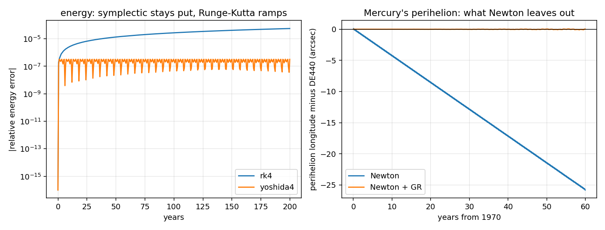
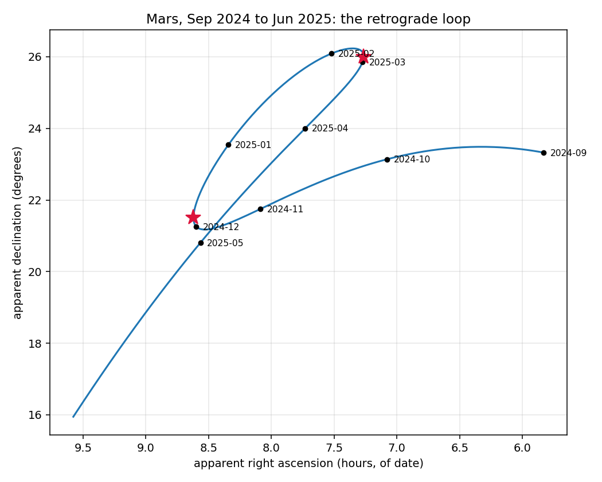
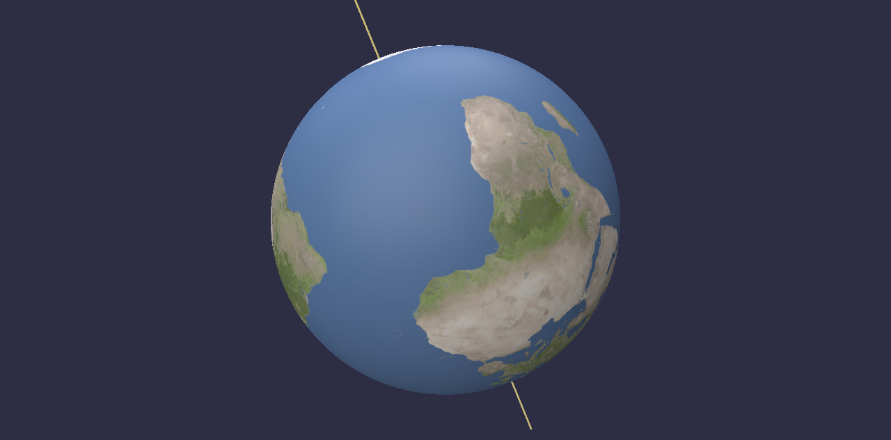
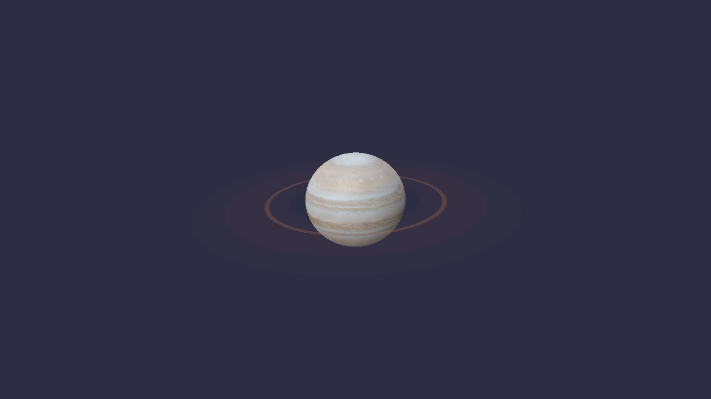
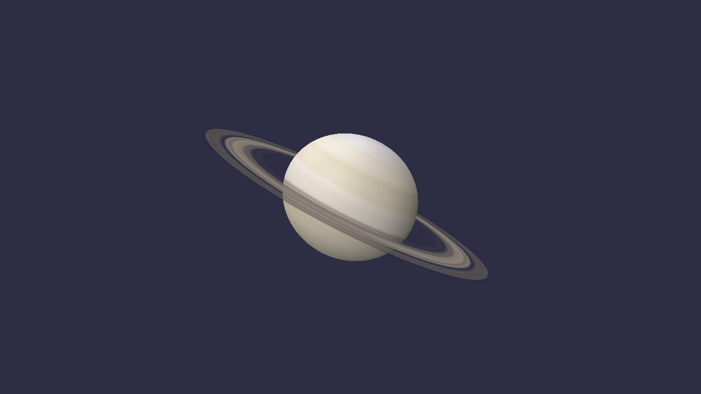
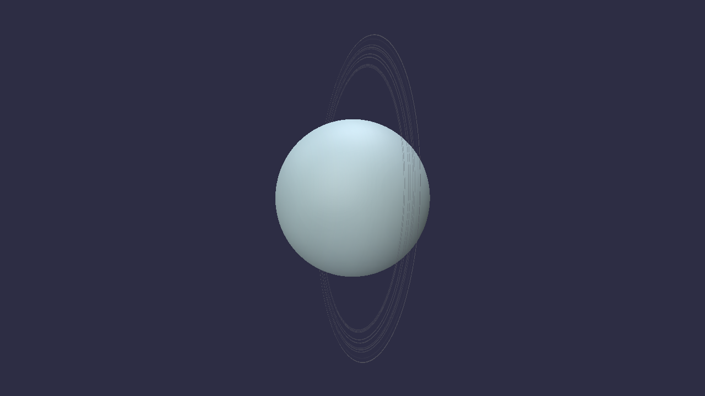

# The milestones

[← back to the README](../README.md) · [notes](notes.md)

The project was built in seven steps, M0 to M6. Each one adds a capability and
each one is *gated*: before it counts as done, it has to be measured against an
independent implementation of the same question -- usually JPL's DE440
ephemeris, sometimes published observations, never a constant recalled from
memory.

`scripts/validate_m*.py` are those gates. They print what they measured, which
is what the tables below are. Run any of them yourself; `--offline` reproduces
every number from the fixtures committed in `data/`.

| | adds | gated on |
|---|---|---|
| **M0** | Elements to a position. No graphics at all. | DE440, 2001 dates across 1850-2050 |
| **M1** | The 3-D scene: spheres, orbit rings, trails, a date scrubber | Conjunction, transits, oppositions -- with no window open |
| **M2** | Real gravity: every body pulls on every other | Conservation over 1000 years; 50-year drift; Mercury's perihelion |
| **M3** | The view from Earth: light-time, aberration, parallax | Apparent places against Skyfield; transits timed from real observatories |
| **M4** | Eclipses | Two solar and one lunar against *observed* circumstances |
| **M5** | Surface maps, axial tilt, rotation, rings, oblateness | Published obliquities and periods; the analemma; ring radii |
| **M6** | The Moon, computed here rather than borrowed | Meeus's worked example; DE440 over a century; what it costs an eclipse |

---

## Why gate before drawing anything

A wrong orbit still looks like an ellipse. Planets still circle, still speed up
near perihelion, still make a perfectly convincing picture. There is no visual
symptom for a bad angle conversion, a rate applied per year instead of per
century, or a mistyped digit — so the only honest check is an independent
implementation, and DE440 is not an approximation of this model but a numerical
integration fitted to radar ranging and spacecraft tracking.

Two checks in `tests/` exist for failures that leave no other trace:

- **The element table is diffed against JPL's live page**, digit for digit. One
  wrong digit would move a planet while every conserved quantity still checked
  out, every orbit still closed, and the result was still an ellipse. All 96
  published numbers match. (JPL's current table 1 covers the eight planets;
  Pluto's row is from an earlier revision and rests on the gate alone.)
- **Rates are asserted to be per century, not per year.** Earth's mean longitude
  advances ~36000°/century. Reading that as degrees per year builds a solar
  system that runs a hundred times too slow and looks entirely normal.


## What M0 measures

41 dates was not enough — the error oscillates rather than growing, so a coarse
grid samples the envelope by luck. This is 2001 dates, every ~36 days from 1850
to 2050, against JPL DE440:

| body | max position error | rms | max sky error from Earth |
|---|---|---|---|
| Mercury | 6 800 km | 2 100 km | 35″ |
| Venus | 14 800 km | 6 500 km | 74″ |
| Earth–Moon barycentre | 16 700 km | 7 000 km | — |
| Mars | 100 700 km | 35 600 km | 211″ |
| Jupiter | 1 863 000 km | 832 000 km | 631″ |
| Saturn | 4 977 000 km | 2 691 000 km | 829″ |
| Uranus | 1 681 000 km | 971 000 km | 127″ |
| Neptune | 1 606 000 km | 904 000 km | 61″ |
| Pluto | 1 570 000 km | 895 000 km | 60″ |

Read the two columns as different questions. **Position error** is dominated by
along-track displacement — the planet is on very nearly the right orbit, at
slightly the wrong point along it — which is why the kilometre figures look
alarming while the angles stay small. **Sky error** is what an observer would
notice, and it folds in Earth's own error too, since you have to stand
somewhere.

Jupiter and Saturn are the worst by an order of magnitude, and that is not a
transcription error: they sit near a 5:2 resonance, and their mutual pull
produces a periodic term in longitude with a period of centuries. A model whose
elements drift *linearly* cannot represent a term that oscillates, so it eats
the amplitude as error.


## What M0 already answers

No graphics required:

```
Earth-Moon barycentre, 2026
  perihelion  2026-01-03 18:14   0.983304 au
  aphelion    2026-07-05 09:22   1.016704 au

Mars at opposition
  2020-10-14   0.419 au      2027-02-19   0.678 au
  2022-12-08   0.550 au      2029-03-25   0.649 au
  2025-01-16   0.644 au      2031-05-04   0.559 au
```

Every opposition date but the first matches the published one exactly; 2020 is
a day out. Nothing in the code knows when Mars is at opposition — it falls out
of Earth and Mars both being in the right place.

The oppositions are not exactly 180° of elongation because Mars's orbit is
inclined to Earth's, so the two rarely line up perfectly in latitude. That is
real, not slop.


## What M1 checks

A rendering layer can be wrong in ways the positions cannot: an orbit ring drawn
from the wrong epoch, a trail that silently extrapolates past the table, a
planet drawn somewhere its own orbit does not go. None of those look wrong on
screen. So `scene.py` holds all the geometry and `view.py` holds nothing but
wiring, and the gate runs with no window at all.

| gate | result |
|---|---|
| Rings carry their planets | worst gap = 1.000 × the polyline's own sagitta |
| Trails end at the planet | 3 × 10⁻¹² au, and never sampled outside 1800–2050 |
| Jupiter–Saturn, Dec 2020 | +10.4 h vs DE440 |
| Venus transits 2004, 2012 | on the disc both times; contacts within 0.1 h |
| Mars oppositions, 1990–2050 | 28 found, 28 matched, rms 0.4 h, worst 1.1 h |

Every event is computed from DE440 by the *same* finder, never against dates
copied from an almanac. An almanac disagreement cannot tell you whether the
model or the definition is at fault — published opposition dates use apparent
geocentric right ascension, this uses maximum elongation, and those two differ
by hours on their own.

The conjunction's 10.4 hours is not a surprise, it is M0's prediction coming
true. On that date Saturn sits 2.5′ from where it should, the separation curve
at closest approach is nearly flat, and a flat minimum converts a small position
error into a large time error. Oppositions have no such problem — the elongation
curve there has real curvature — which is why the same model is 25 times more
accurate about them.


## What M2 measures

The fixed ellipses are gone. Every body pulls on every other, the Sun included,
and the whole thing is integrated in the barycentric frame with a fourth-order
symplectic method.

**Conservation, 1000 years, 2-day step.** Energy swings by 5.7 × 10⁻⁷ of itself
and stays in that band; its linear trend over the whole span is 0.3% of the
swing. Runge-Kutta at the same step drifts 150,000 times faster. Angular
momentum holds to 6 × 10⁻¹⁵, linear momentum to 10⁻²².

**Fifty years against DE440**, started from DE440's own state vector, GR on,
0.1-day step. The error is split along the direction of travel and across it,
because the two mean different things:

| body | across track | along track |
|---|---|---|
| Mercury | 375 km | 112,000 km |
| Venus | 16 km | 6,100 km |
| Earth–Moon barycentre | 4 km | 6,800 km |
| Mars | 3 km | 213 km |
| Jupiter | 3 km | 90 km |
| Saturn | 0 km | 9 km |
| Uranus | 35 km | 146 km |
| Neptune | 150 km | 201 km |
| Pluto | 195 km | 101 km |

*Across* is whether the orbit is the right shape, in the right plane, at the
right orientation — that is the force model, and 375 km over fifty years says
the masses and the interactions are right. *Along* is only whether the planet is
at the right point on that orbit, and a fixed-step integrator gets it slightly
wrong forever: its shadow Hamiltonian implies a mean motion a hair off the true
one, and the phase error accumulates. Mercury shows it first because it laps
everything else.

**Mercury's perihelion.** The headline, and the reason M2 exists.

```
integrator artifact     67.57"/cy   (two-body control; the true answer is 0)
Newtonian gravity      528.74"/cy
with the GR term       571.70"/cy
DE440                  571.76"/cy

Newton falls short by   43.03"/cy
the GR term supplies    42.97"/cy   (theory says 6πGM/c²a(1-e²) = 42.98)
leaving                 -0.06"/cy against DE440
```



Eight planets pulling on each other get Mercury's perihelion to within 43
arcseconds per century of where it really goes, and no arrangement of Newtonian
masses closes that gap. One term — `GM/(c²r³)[(4GM/r − v·v)r + 4(r·v)v]` — closes
it to six hundredths of an arcsecond.


## What M3 measures

Everything up to here computed geometry, and nobody has ever observed geometry.
Light takes minutes to arrive, bends past the Sun, and lands tilted by the
observer's own motion; the frame it is quoted in drifts; and the observer is not
at the centre of the Earth. For Mars today those come to:

| correction | size |
|---|---|
| light-time (15.3 minutes) | 12.98″ |
| aberration | 11.17″ |
| gravitational bending | 0.004″ |
| precession + nutation to date | 1350.55″ |

Aberration alone is larger than Mercury's entire M0 sky error. A model right to
an arcsecond and uncorrected is wrong by twenty.

The gates are layered so each measures one thing, and each is fed *exactly* the
same DE440 geometry as Skyfield — so a disagreement is a transformation, never
an orbit.

**The physics chain** — light-time, deflection, aberration — agrees to between
3 × 10⁻⁸ and 7 × 10⁻⁵ arcsec. That is not a tolerance, it is the interpolation
noise floor; the transformations are exact.

**The equinox of date** agrees to 0.02–0.50″, and — the point — *by the same
amount for every body*, to within 0.009″. A frame error looks like that. A
physics error does not. The floor is the four-term nutation series, not anything
fixable without IAU 2000A's 1365 terms.

**Standing somewhere** agrees to 0.012″ against Skyfield's own topocentric
places, while parallax itself moves Venus by up to 28″.

**Retrograde**, the observation that broke the geocentric model, comes out
within 1.1 minutes of Skyfield: Mars turns on 2024-12-07, backs up for 79 days,
and turns again on 2025-02-24.



### The transits, timed from real places

The 2004 and 2012 Venus transits, in UT, computed for three observatories at
once:

```
Venus transit of 2004
  (geocentric)                  05:14  05:33  11:06  11:26
  Royal Observatory, Greenwich  05:20  05:40  11:04  11:23
  Mauna Kea                     05:09  05:29  11:03  11:23
  Paranal                       05:14  05:34  11:13  11:32
```

First contact differs by **11 minutes** between sites. That difference is
parallax, and measuring it during the transits of 1761 and 1769 is how the
astronomical unit was first pinned down. The geocentric times land within about
a minute of the published values — the first number in this project checked
against an observation rather than against JPL.


## What M4 measures

Everything built so far has to be right at once, and for the first time the
answers are checked against **observations** rather than against JPL. Eclipse
circumstances are published to the second and were watched by millions.


That is the axis of the Moon's shadow — placed by DE440, corrected for
light-time, intersected with a WGS84 ellipsoid turned by the IAU rotation
elements and clocked by measured delta T — crossing the ground on 2 August 2027.

| gate | result |
|---|---|
| The cones | 2024 cone 374 195 km vs a Moon at 359 779 → reaches → **total**; 2023 cone falls **24 415 km short** → **annular** |
| 2017 and 2024 total solar | landing point 19 km and 17 km from published; totality +2 s at both |
| 2025 total lunar | seven contacts, worst 2.8 min |
| Saros | one saros on, the same eclipse, **119°** further west |

The cone gate is the one worth pausing on. Whether an eclipse is total or
annular is not looked up — it falls out of similar triangles. The umbral cone is
374 000 km long and the Moon averages 384 400 km away, so the tip usually
misses, and totality exists only in the few percent by which the Moon's distance
varies.

For 2027, from places along the track:

```
  place                         kind  magnitude  obscured   central
  Luxor, Egypt                 total      1.036    100.0%    6m 22s
  Jeddah, Saudi Arabia         total      1.029    100.0%    6m 00s
  Tangier, Morocco             total      1.034    100.0%    4m 54s
  Cadiz, Spain                 total      1.008    100.0%    2m 56s
  Rome, Italy                partial      0.786     74.6%        --
```

Six minutes twenty-two at Luxor, against a published maximum of 6m 23s. It is
the longest totality anywhere on land until 2114.


## What M5 measures

The planets are spheres carrying real maps, turned to their real orientation for
the date: the IAU pole, the axial tilt, and the prime meridian where it actually
was.



That is the Earth seen from the Sun at 12:00 UT. Africa faces us because the
sub-solar longitude is 0.2 degrees east — and that is the check, not the
picture. If anything in the chain from the rotation elements through the
body-fixed frame to the texture coordinates were wrong, a different ocean would
be lit.

None of M5's gates look at the rendering. Every failure mode still looks like a
planet.

| gate | result |
|---|---|
| Rotation periods, from the tabulated W rates | worst 5 × 10⁻⁶ of the period, across 9 bodies |
| Obliquities, from the poles and M0's orbits | within 0.01° for 8 of 9 |
| The analemma | ±23.44° latitude, 30.6 min of equation of time, all four season dates exact |
| The map's orientation | 10/10 known coastlines land or sea as they should |
| Shape | flattening derived from published radii; ring edges are published radii |

The analemma is the one that matters. The rotation table contains a pole and an
angle that ticks; it knows nothing about seasons. Track the sub-solar point at
noon UT for a year and out falls the Sun's declination reaching exactly the
obliquity, the equation of time spanning 30.6 minutes against a published 30.5,
and the solstices and equinoxes on 21 June, 21 December, 20 March and
23 September 2026 — the right days.

The viewer has a **focus** mode: pick a body and the camera goes to it at true
size, with the time scrubber still running, so you can watch it turn. The
focused body is drawn at the origin rather than at its real position — a planet
is 4 × 10⁻⁵ au across sitting 1 au out, and a camera close enough to read the
map would be resolving one part in 25 000 of the scene, which the depth buffer
will not do.

Planets are flattened by their own spin, from published polar and equatorial
radii: 0.098 for Saturn, 0.065 for Jupiter, 0.0034 for the Earth. The squash is
applied *before* the rotation so it follows the tilt — doing it after leaves
every planet flattened about the ecliptic pole, which looks plausible until
Saturn is squashed the wrong way relative to its own rings.

Three ring systems are drawn, every edge a published radius: Saturn's C, B,
Cassini division and A; Jupiter's halo, main and two gossamer rings; and all ten
of Uranus's, by name, from **6** out to **ε**. Geometry is emitted only where a
ring actually is — Uranus's rings cover under 2% of their span, so one disc plus
opacity would be 98% empty and the radial samples would land between the rings
and miss them entirely.

Uranus's rings are drawn at least 250 km wide against a real narrowest of 2 km,
which is a sixtieth of a pixel. That is the same bargain as the planet radii,
and the gate prints both numbers.

Planet maps are from **Solar System Scope**, CC BY 4.0.


| | | |
|:-:|:-:|:-:|
|  |  |  |
| Jupiter: four bands, faint | Saturn: A, B, C and the Cassini division | Uranus: ten hairlines, drawn at a stated minimum width |

## What M6 measures

Through M5 the Moon came from DE440, which made M4's eclipses a test of shadow
geometry sitting on somebody else's orbit — the last place in this project
where ground truth was an *input* rather than the thing being measured.

`lunar.py` closes that: the abridged ELP-2000/82, five fundamental angles, sixty
periodic terms for longitude and distance and sixty more for latitude.

| gate | result |
|---|---|
| Meeus's worked example | longitude, latitude and distance to **six decimal places** |
| Against DE440, 1950–2050 | **3.12″ rms**, 15.5″ max; distance 3.0 km rms |
| What it costs the 2024 eclipse | **3 km** of track, **0 s** of totality |
| The Moon's periods | all four months, plus 18.61 and 8.85 years |

The third one is the answer to the question the first two only gesture at.
Three arcseconds is abstract; running M4's eclipse machinery on this Moon
instead of DE440's moves the 2024 track by three kilometres and changes totality
at Nazas by under a second. The abridged theory is good enough for the job it
was built for.

The fourth is the one worth looking at:

```
month                 ours   published   days
tropical         27.321582   27.321582
synodic          29.530589   29.530589
anomalistic      27.554550   27.554550
draconic         27.212221   27.212221
sidereal         27.321662   27.321662

nodes regress once in 18.61 years   (published 18.6)
apsides turn once in   8.85 years   (published 8.85)
```

None of that is in the table. Every one is a difference between the rates of
four angles. The tropical and sidereal months differ by 6.9 seconds, and that
6.9 seconds is the equinox moving under the Moon at 50.3 arcsec a year and
nothing else. The 18.61 years is why eclipse seasons drift, and why a saros is
eighteen years and eleven days rather than a round number.

Why the Moon needs sixty terms where a planet needs six: its largest periodic
term is **6.29 degrees**. The Sun's is 1.9. Nothing else in the solar system is
pulled about like this.

